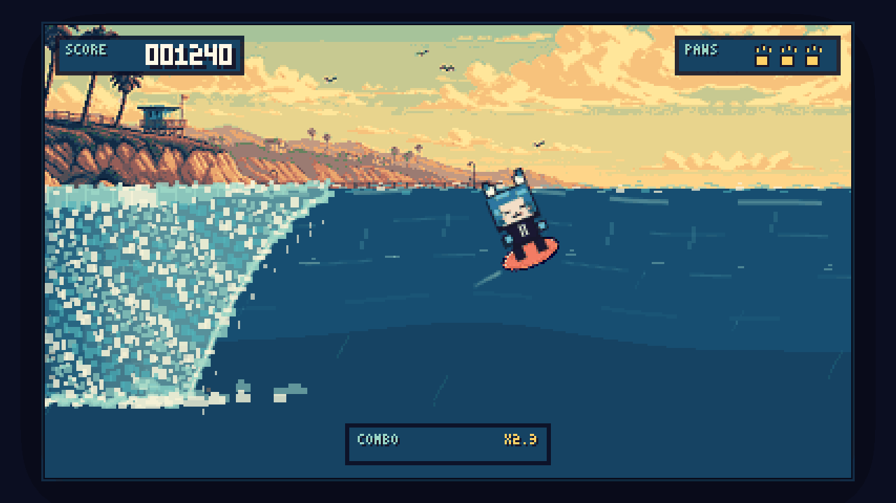

# Kaki Surf

Kaki Surf is a standalone, no-bundler Canvas arcade surfing game starring Kitty Kaki. Endless Surf is the primary survival run, with the original 78-second Score Attack preserved as a separate mode. It runs at a fixed 384 x 216 logical resolution with a 1/120-second simulation step and deploys unchanged to a static host.

**[Play Kaki Surf on GitHub Pages](https://dknos.github.io/kaki-surf/)**



## Quick play

Open the hosted game, or serve this directory over HTTP:

```console
python -m http.server 8000
```

Then visit `http://localhost:8000`, choose a mode, board, and condition, and select the gold start button. No build or package installation is required.

For the reward-free physics harness, open `http://localhost:8000/?qa=coreSurfLab`. It runs one board and one wave with no wildlife, pickups, score, tutorial, or callouts; the compact telemetry can be disabled through the simulation fixture.

Simple Controls are the default:

| Intent | Keyboard | Standard gamepad | Touch |
| --- | --- | --- | --- |
| Travel, carve, and trim | Arrows or WASD | Left stick or D-pad | Direction pad |
| Action: compress, pump, and pop | Space or Z | A or right trigger | **Action** |
| Context trick / tube hold | F or X | X or B | **Trick** |
| Pause | Escape or P | Start | **II** pause button; Settings also pauses |

Advanced Controls preserve manual Turbo and the original Q/E/F/T map and can be selected in Settings: Q is Rail, E is Tail, F is Flip, and T is Twist. See [Controls and gameplay feel](docs/CONTROLS-AND-FEEL.md) for the complete contextual mappings.

The standard gamepad now owns the whole arcade loop: stick/D-pad navigation, A to activate, B to close dialogs or instantly retry results, and Start to pause/resume. Directional focus repeats deliberately, while sliders and selects adjust in place. Touch controls appear automatically on coarse-pointer or compact touch devices, stay off fine-pointer desktops, and neutralize safely when the device rotates.

## Surf both ways

The rider can commit to left- or right-going travel. Every fixed step derives one canonical path velocity from along-break travel plus face motion. Board heading, Kaki lean, wake, spray, camera lead, parallax, animation, audio, mount direction, and landing tangent consume that result instead of mirroring independently. A normal reversal now draws and scrubs through a 0.35–0.5 second arc before the new direction commits.

Wave geometry now supplies the main drive without continuously attracting the board toward a base target. Dropping adds substantial speed, climbing spends it, traversing keeps most of it, and a hard reversal or poor contact scrubs it. One committed drop carries enough energy into the next climb; Action enhances a good line instead of granting permission to move.

Speed, Turbo, and Flow have separate jobs:

- **Speed** is canonical path motion and is communicated primarily by the trajectory wake, tail spray, parallax, pose, and audio.
- **Turbo** remains an optional Advanced-only overdrive. Simple mode has no manual Turbo control or meter.
- **Flow** is the run's combo/style state. Valid full carves, timed pumps, direction changes, varied tricks, clean landings, and wildlife moments build it. A strong line can briefly sustain earned Flow, but passive riding, repetition, stalling, wobble, and wipeouts reduce it.

The persistent play HUD is limited to score, time or paws, and a compact combo only while it is active. Speed, Turbo, Flow, Set, powerup, and pump meters no longer compete with the wave read.

Simple Controls make Trick contextual: hold it inside Twilight's critical pocket to tuck into the tube, or use it around a launch to buffer an eligible aerial move. A large move that no longer fits falls back to a readable grab, and late descent begins helping the board toward the nearest valid landing tangent. Advanced Controls retain direct on-wave maneuvers, a dedicated held Tube Tuck/Soul Arch, and compositional Q/E/F/T aerial inputs. Aerial points remain provisional until landing.

Fresh profiles open on **Twilight Glass** and receive six small contextual **Surf School** prompts: drop for speed, climb with carried speed, cut back, hit the lip, trick, and match the landing. Each lesson advances only after the physical action succeeds and can be armed again from Settings.

## Run modes

- **Endless Surf** is the default. There is no hidden clock: the run ends after three wipeouts. Every 36 seconds of active riding advances a visible Set, increases curl pressure, and raises the scoring stake through Set 7. Entry and wipeout recovery do not advance the set timer or distance.
- **Score Attack** preserves the focused 78-second run and countdown audio. It uses the same surfing, wildlife, conditions, and scoring systems without Endless escalation.

Each mode owns independent best score, Flow, distance, set, and survival-time records. Existing pre-mode saves migrate their previous score and Flow to Score Attack, while the additive v1 save schema, all-mode legacy best, settings, boards, tutorial state, and run count remain intact. Results show mode, active ride time, distance, highlights, and a compact breakdown; long trick names receive a full-width row instead of colliding with adjacent statistics.

Every condition is now staged on the same production side-view break. The whole playfield is one long rideable face; the breaking edge is assembled from narrow fixed screen columns whose noisy heads accelerate downward while their revealed foam tiles stay behind as whitewater. The diagonal edge is pinned to the simulation's catch contact, advances left-to-right from the opening seconds, and never mirrors or rewinds when Kaki reverses. Twilight's eight-second safety grace still prevents an early catch, but no longer freezes the barrel visually. A strong right-going line can scroll the entire break off the left edge before escalating pressure independently brings it back; a left cutback uses the earned screen width without reversing the camera. The cleared area restores the real condition sky and low backwater instead of an opaque image field. Twilight retains the deeper rideable pocket and large-air camera treatment. Reduced Motion freezes detached spray and vertical camera shift without changing gameplay.

## A living coast

`WorldSimulation` owns a seeded, bounded world layer that is independent from the renderer. Far, mid, and near traffic includes sailboats, fishing boats, speedboats, birds, planes, helicopters, banner flights, and rare Fleet Airshow/carrier events. Signed `worldTravel` keeps scenic parallax direction-aware, while bounded camera influence prevents ambient traffic from ping-ponging when the rider reverses. Boat-only waterline bands and breaker-aware occlusion keep ordinary hulls off the curl while preserving deliberate wake-race craft ahead of it.

Wildlife and bonuses are gameplay, not decoration:

- dolphins offer a friendly ride and a special dismount launch;
- sharks use readable telegraphs, a collision consequence, and a near-miss/thread bonus;
- production whale scheduling is temporarily disabled; forced QA phases use one water/collision anchor, deterministic breach arc, foreground water mask, and displacement foam until the encounter is deliberately re-enabled;
- bird flocks dodge harmlessly for Feather Thread, couriers drop fair pickups, and speedboats or jet skis offer no-penalty wake races;
- Dolphin Ride and Fleet Airshow use simulation-owned foam-gate series;
- Mango Rush reduces uphill loss, Moon Pop boosts the next launch, and Star Foam protects Flow from one dangerous contact or wobble.

Spawn streams, quiet periods, capacities, culling, collision sweeps, interactions, and presentation events are all simulation-owned and deterministic for a seed.

## Boards and conditions

- **Foam Puff** is the beginner recovery board: rounded, stable, and easiest to auto-level in Simple mode.
- **Mango Fish** is the technical combo board: fast rails, strong grip, and quick spins.
- **Moon Log** is the expert glide board: the highest cap and pop, slower correction, and high-value long holds.

Golden Coast and Stormbreak retain the `classic` physics profile while Twilight Glass uses the deeper `heroBarrel` profile and rideable tube pocket. All three now select the column-built long-face renderer, start with the visible catch edge at x=30, and share collision-registered presentation plus nearly full-screen ride/air bounds. Future levels can author distinct wave silhouettes without duplicating the canonical wave-query, movement, landing, or scoring contracts.

Audio follows the game lifecycle instead of free-running behind it. Ocean body, board contact/carve, and aerial wind use separate filtered layers; speed, pocket risk, and surface contact drive their mix. Pause, results, visibility loss, and resume fade or rebase the transport so missed beats never burst after a long interruption. Major landings, wipeouts, power moments, and records duck the music through a master limiter, and Settings includes independent music/effects/wave levels plus a persistent master mute.

## Local art pipeline

The static game loads six condition backgrounds and 13 compact generated atlas families. The active wave remains code-native and collision-aligned, with a crisp crest, darker trough, five queried contour/foam seams, a readable pocket and power seam, moving projected flecks, foreground water, and shared tube/whitewater contact. The board-contact effect is one sampled trajectory wake rather than overlapping sprite-local systems.

Every atlas is optional. `js/asset-loader.js` validates each family independently, and the Canvas renderer keeps a local code-authored fallback when one is absent or invalid. The browser never calls Grok, Blender, an image API, a CDN, or a remote asset host. Exact prompts, selections, source hashes, and output dimensions are recorded in [Grok asset provenance](docs/GROK-ASSET-PROVENANCE.md).

## Validation

```console
npm test
npm run check
git diff --check
```

The native suite passes **200/200 tests** and the syntax gate checks **33 JavaScript modules**. New invariants cover canonical board/path agreement, mirrored wakes, no front-facing wake, carried drop/climb energy, cutback timing, full-face traversal, contextual mount dismounts, quiet Core Surf Lab ownership, whale water/collision anchors, breach endpoints, foreground masking, disabled production whale scheduling, and the reduced Simple HUD. The local gallery contains **128 deterministic 1280 x 720 captures**, including Core Surf Lab, both travel directions, downhill mirror pairs, uphill carry, reversal, launch/landing, and whale takeoff/apex/return. This checkpoint is local and does not claim that GitHub Pages has refreshed.

## Static deployment and integration

Browsers require the native modules to be served over HTTP rather than opened through `file://`. All runtime imports and assets use relative local URLs; there is no bundle, generated application directory, remote gameplay asset, or runtime generation API.

`js/integration-adapter.js` exports `createKakiSurf({ host, input, audio, storage, settings, profile, onExit, onRunComplete, qaScene })`. It returns `start`, `pause`, `resume`, `restart`, `destroy`, and `getSnapshot` lifecycle methods.

Gameplay truth remains renderer-independent: `js/wave.js` owns profile-selected ride geometry, `js/simulation.js` owns rider physics and interactions, `js/world.js` owns the ambient/gameplay world, `js/tricks.js` owns the aerial manifest, and `js/scoring.js` owns Speed/Flow valuation and score banking. `js/hero-wave-visuals.js` presents the shared travelling break, tube opening, passed-sky window, and downward whitewater by consuming those canonical queries rather than inventing a visual-only surface. See [ADR-001](docs/ADR-001-standalone-canvas.md), [Asset manifest](docs/ASSET-MANIFEST.md), and [Hero source map](docs/HERO-SOURCE-MAP.md).
